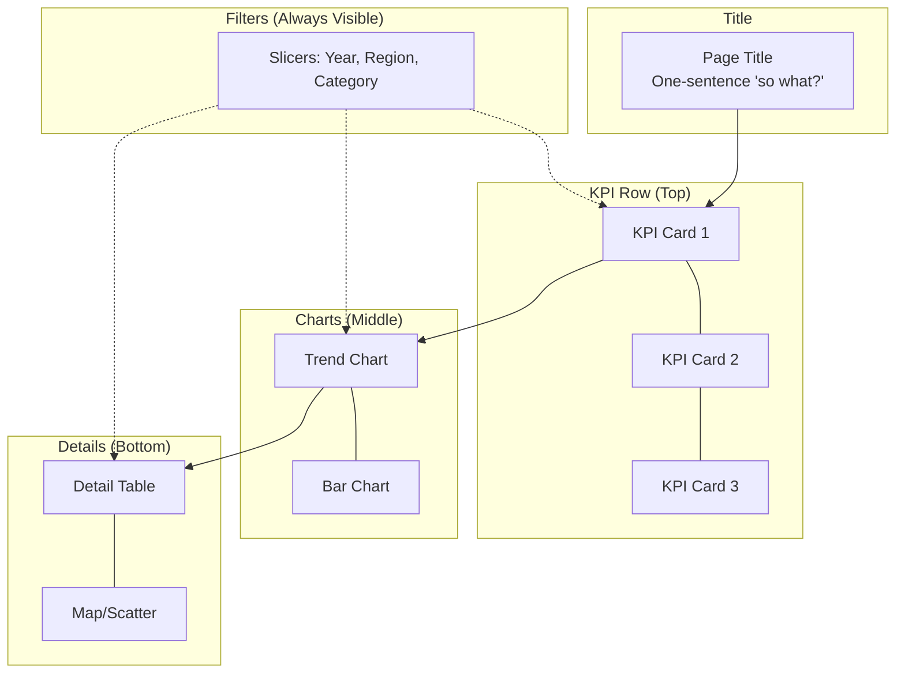

# DASH Dashboard Framework

Design stakeholder dashboards around decisions, not data.

## DASH Framework

### D — Decision

Every dashboard page must enable a specific decision:

| Page | Decision Enabled | Owner |
|------|------------------|-------|
| [Page name] | [What question does it answer?] | [Who decides?] |

**Decision Frequency:** How often is this reviewed? (Daily / Weekly / Monthly)

### A — Audience

Same data, different presentations per audience:

| Audience | Technical Level | Dashboard Implication |
|----------|-----------------|----------------------|
| Executives | Low (outcomes) | Big picture, trends, minimal numbers |
| Managers | Medium (trends + detail) | Charts + summary tables, drillable |
| Analysts | High (exploration) | Filters, dimensions, detailed tables |

### S — Signal

Top 3-5 metrics per page that matter for the decision:

**Page: [Name]**
1. **[Metric 1]** — [Why it matters]
2. **[Metric 2]** — [Why it matters]
3. **[Metric 3]** — [Why it matters]
4. **[Metric 4]** — [Why it matters]
5. **[Metric 5]** — [Why it matters]

### H — Hierarchy

Visual hierarchy guides the viewer's eye:



**Rules of Thumb:**
1. Top to bottom, left to right — most important first
2. Start high-level (KPI cards), move to details
3. Color sparingly — only when meaningful
4. 60-second rule — can a stakeholder read the story in 60 seconds?

### Color Palette Template

- **Primary** (blue): Revenue, positive metrics
- **Secondary** (orange): Warnings, attention areas
- **Neutral** (green): On-time, positive performance
- **Text** (dark gray): All labels and titles

## Implementation Checklist

For each dashboard page:
- [ ] Title: One-sentence "so what?" explanation
- [ ] Top: 3-5 KPI cards with comparison context
- [ ] Middle: Visual trend charts
- [ ] Bottom: Detail table or deep-dive visualization
- [ ] Filters: Slicers always visible (Year, Region, Category)

## Page Structure Template

Document each page with:

```markdown
### Page [N]: [Name]

**KPI Cards:**
- [Metric 1] — [Value context]
- [Metric 2] — [Value context]

**Visuals:**
- [Chart type]: [What it shows]

**Business narrative:**
> "[One sentence: what does this page tell the stakeholder?]"
```
