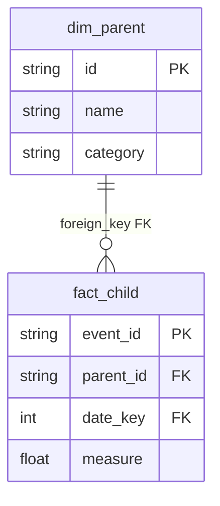
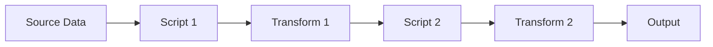
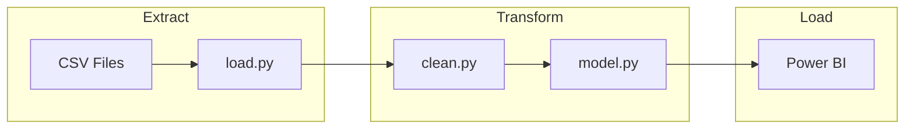
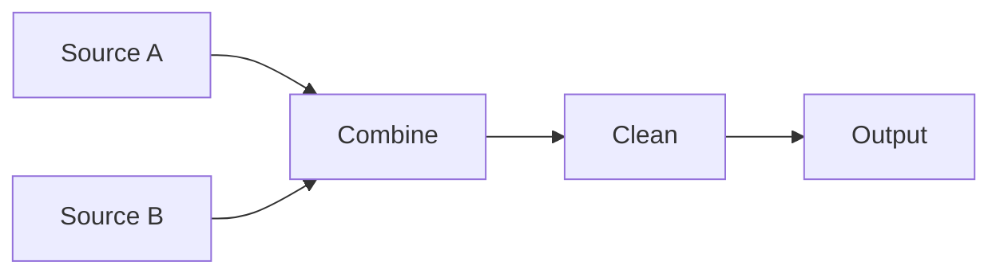
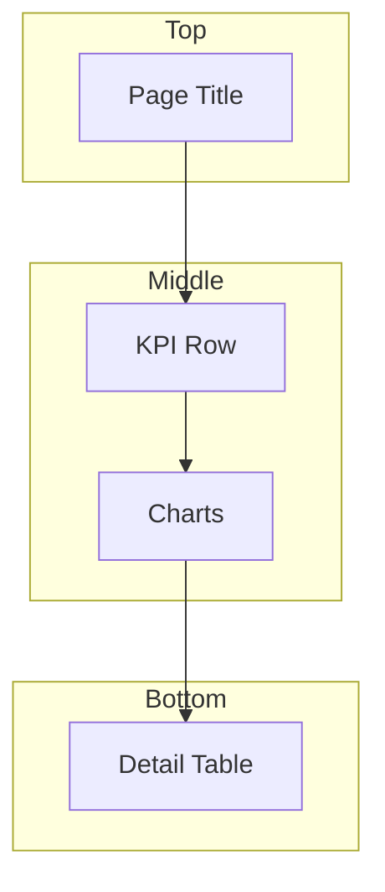

# Mermaid Diagram Generation

Create clear, maintainable diagrams for technical documentation using Mermaid.js syntax.

## Diagram Types

### ER Diagram (Data Models)

Best for: Star schemas, entity relationships, database models

Key rules:
- `||--o{` means one-to-many (parent to child)
- PK marks primary key, FK marks foreign key
- Fields grouped by entity with type annotation

### Flowchart (Pipelines & Processes)

Best for: Data pipelines, workflows, ETL sequences

Subdividing with subgraphs:

### Flowchart with Parallel Paths

Best for: Multi-source pipelines

### Graph / Hierarchy

Best for: Page structures, navigation, org charts

## Syntax Guidelines

- Use `A --> B` for directional flow, `A --- B` for undirected
- Use `A -->|Label| B` for labeled edges
- Use `A -.-> B` for dashed lines (optional paths)
- Use `A == > B` for thick lines (emphasis)
- Use `style A fill:#f9f,stroke:#333` for custom styling
- Use ` ` for multi-line node text
- Use backticks inside node text: `` `code` ``

## When to Use Each Type

| Use Case | Diagram Type | Notes |
|----------|-------------|-------|
| Database schema | `erDiagram` | Shows relationships clearly |
| Data pipeline | `flowchart LR` | Left-to-right reads naturally |
| Process/decision | `flowchart TD` | Top-down for sequential steps |
| Page structure | `graph TD` | Hierarchy visualization |
| Architecture | `flowchart LR` with subgraphs | Group by layer |
