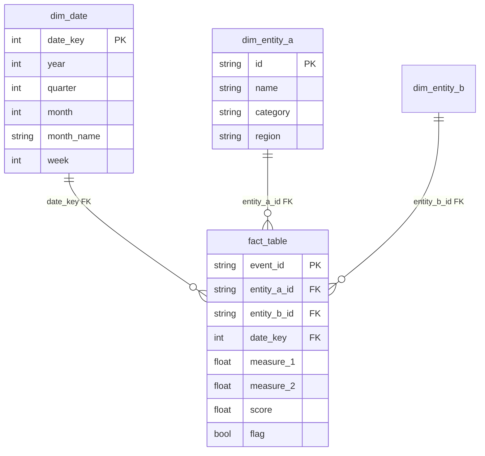

# Star Schema Design

Design analytical data models optimized for slice-and-dice queries.

## Core Concepts

### Fact Tables
- Store **measures** (revenue, quantity, score, days)
- One row per **business event** (order, transaction, click)
- Foreign keys to dimensions
- Add boolean flags for classifications (is_late, is_repeat)

### Dimension Tables
- Store **entities** (time, product, customer, seller)
- One row per entity instance
- Descriptive attributes for filtering and grouping
- Narrow column types (VARCHAR for strings, INT for codes)

## Pattern: Core Star Schema



## Fact Table Design Patterns

### Design Decisions

| Pattern | When to Use | Example |
|---------|-------------|---------|
| Transaction fact | One row per event | Sales order |
| Periodic snapshot | Regular measurements | Monthly inventory |
| Accumulating snapshot | Track process lifecycle | Order fulfillment stages |

### Column Guidelines

- **Measures**: Numeric, additive where possible
- **Flags**: Boolean for classification (is_late, is_returned)
- **Dates**: Use integer keys year_month (201801) or date dimension FK
- **IDs**: Match source system type (VARCHAR for UUIDs, INT for sequential)

## Dimension Table Design Patterns

### Time Dimension (dim_date)

Always include. Essential for trend analysis:

```sql
CREATE TABLE dim_date (
    date_key INT PRIMARY KEY,
    date DATE,
    year INT,
    quarter INT,
    month INT,
    month_name VARCHAR(20),
    year_month INT,  -- 201801 format
    week INT
);
```

### Other Common Dimensions

| Dimension | Key Columns | Notes |
|-----------|-------------|-------|
| Customer | customer_id, unique_id, region, segment | Use unique_id for repeat analysis |
| Product | product_id, category, subcategory, weight | Translate names if multilingual |
| Seller | seller_id, state, city, segment | For marketplace analyses |
| Channel | channel_id, source, medium, campaign | For marketing attribution |

## Naming Conventions

- `dim_entityname` — Dimension tables
- `fact_eventname` — Fact tables
- `kpi_metricname` — KPI/aggregation views
- `report_reportname` — Report-specific views

## Anti-Patterns

- **Joining dimension to dimension**: Should always go through fact table
- **Wide dimensions with 50+ columns**: Split into related dimensions or use SCD
- **Fact tables with text descriptions**: Those belong in dimensions
- **Natural keys in fact tables**: Use surrogate keys for stability

## Verification Checklist

- [ ] Fact table has at least one measure
- [ ] Each dimension has a clear primary key
- [ ] All joins are one-to-many (dimension → fact)
- [ ] Date dimension covers the full data range
- [ ] KPI views reference the star schema, not raw tables
